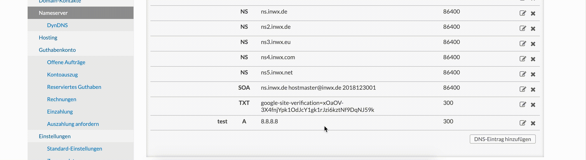

# Docker container to update INWX DNS entries

This docker is built to update your DNS entries of your INWX A record. You could use this docker image to build your own DynDNS entry, if your router doesn't support it.

## Required environment variables

|Variable|Description|
|--|--|
|INWX_USER|That is your user to login to INWX|
|INWX_PASSWORD|That is your password to login to INWX|
|DYNDNS_DOMAIN|That specifies the subdomain you'd like to use.|
|INWX_DOMAIN_ID|That entry should contain the ID of the domain entry in the INWX ns list|
|SLACK_DEBUG|This entry is required, if you'd like to send update-debug messages to slack.|

### How to get the INWX_DOMAIN_ID

You can find the INWX_DOMAIN_ID when you take a look into your INWX interface.



### Example Environment File

```text
INWX_USER="username-1"
INWX_PASSWORD="password-of-username-1"
DYNDNS_DOMAIN="this.is.just.a.test.nextunit.io"
INWX_DOMAIN_ID="whatever-dns-entry-id"
SLACK_DEBUG="https://hooks.slack.com/services/XXXXXX/XXXXXXXX/XXxxXXxx"
```

## Run Docker

To run the docker container with the specific environment-file, just use the following command:

```sh
docker run --rm --env-file "./path/to/environment-file.conf" nextunit/inwx-dyndns
```